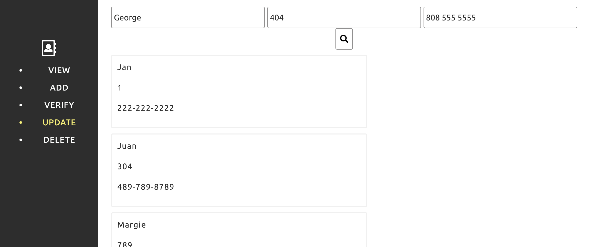

# Employee Directory

For this assignment you will be building an online employee directory for your company using your DOM manipulation library and Bootstrap.

Please watch this video on single page applications **_before_** getting started: <https://youtu.be/_gDMQzNVxQA>

### Preparation

  1. Find `index.html`. Note that this is the only `html` file that you will be working with. Since this is a **single page application** (SPA, see video above), you will need to hide and show sections as necessary.

  2. Find and review `dom.js`. This is the same DOM library that we created earlier. You will be using it to manipulate the content in `index.html`. Note that `index.html` is already linked with `dom.js`

  2. Find and review the array of employees in the `employeeList.js` file. Take a moment to consider how you will use this _array_ of _objects_ to dynamically edit the content in your SPA. Note that `index.html` is already linked with `employeeList.js`

  3. Create a file called `app.js` and link to it from `index.html`.

### Requirements

Your application must have a polished front-end that dynamically renders the directory with the following functionalities from `app.js`:

1. A `View` option that displays all employee info:

2. An `Add` option that allows users to input name, office number, and phone number and then renders the updated employee list.

3. A `Verify` option that allows users to input a name and renders `yes` if the employee exists and `no` otherwise.

#### Challenge:

The following are additional functionalities that you should consider for your application. It's a bit of a challenge, but give it a shot. These concepts will become important as we continue with the course.

4. An `Update` option that allows the user to input name, office number, and phone number and updates the office number and phone number of the employee that matches the input name, and then renders the updated employee list.

5. A `Delete` option that deletes the employee with the matching name and then renders the updated employee list.

